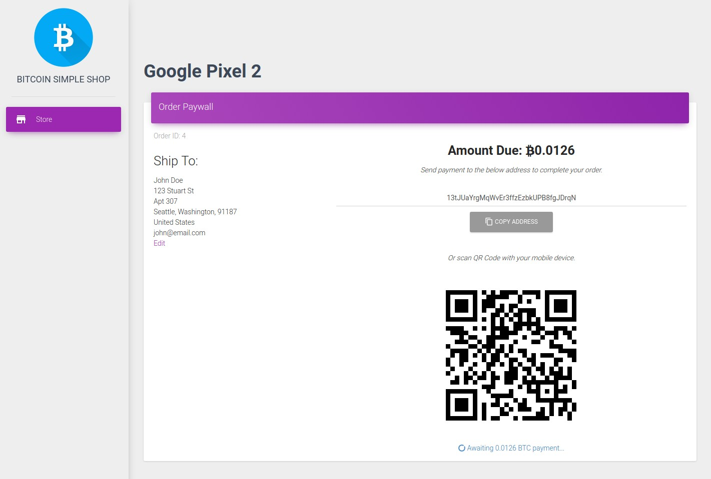

# Bitcoin Simple Shop

*Proof of concept for a Bitcoin only e-commerce site using [Blockchain.info Wallet](https://blockchain.info/wallet). This project is intended for small shops with few products (but please don't use it for real business).*

## Requirements
- Composer
- PHP 7.0+
- Apache or NGINX server.
- MySQL server
- Bitcoin wallet on [Blockchain.info](https://blockchain.info/wallet)
- API key for [Blockchain Receive Payments API V2](https://blockchain.info/api/api_receive)

## Installation

Clone this repo to the server root directory.

```
$ git clone https://github.com/elvismdev/Bitcoin-E-Commerce-Store.git /srv/public_html/.
```

CD into the server root and install the application dependencies.

```
$ cd /srv/public_html/ && composer install
```
> Composer install will also ask for the application parameters such as DB connection details, application secret token and Blockchain.info API key and xPub for the wallet account. Then it will auto-generate the `app/config/parameters.yml` file. 

Run the commands below to generate an empty database schema for the shop:

```
$ php bin/console doctrine:database:create
```

```
$ php bin/console doctrine:schema:update --force
```

Point the server virtual host to `/srv/public_html/web/`

Load the storefront in your browser `http://myshopdomain.com/`

> Note that you could test drive this simple shop from your own `localhost` or run it using the [Symfony built-in web server](https://symfony.com/doc/current/setup/built_in_web_server.html#starting-the-web-server), but the paywall page *( /pay/{order_id} )* would fail to load, since the application has to be reachable from the Internet to receive the unique BTC address from Blockchain.info API to submit the order payment.

## Store backend

Go to `/admin` and you'll see an HTTP basic auth prompt, use the default credentials:
- User: **admin**
- Pass: **admin**

To change the default password run the command below:

```
php bin/console security:encode-password
```

Copy the generated password hash and replace the default at [this line here](app/config/security.yml#L8). Also you could change the *admin* username [here](app/config/security.yml#L7) for whatever you like to.

> Learn more about Symfony security and how to extend this in the [official docs](https://symfony.com/doc/current/security.html#a-configuring-how-your-users-will-authenticate).

Finally add some products, and have fun (contribute).



#### *Talk Nerdy To Me*
- Built on [Symfony Framework](https://symfony.com/)
- Admin backend by [EasyAdmin](https://github.com/javiereguiluz/EasyAdminBundle)
- Uses [Blockchain.info API](https://blockchain.info/api) for exchange rates and [BTC wallet](https://blockchain.info/wallet) payments
- Frontend with [Material Dashboard](https://www.creative-tim.com/product/material-dashboard) components (and some custom tweaks)
- Icons by [Font Awesome](http://fontawesome.io/)
- [Issues](https://github.com/elvismdev/Bitcoin-E-Commerce-Store/issues) && [PR's](https://github.com/elvismdev/Bitcoin-E-Commerce-Store/pulls) && [Donations](https://blockchain.info/address/18EJr8bG8StbQbtcqZcXwHF87kqLMxZ4rC) are welcome :thumbsup:
